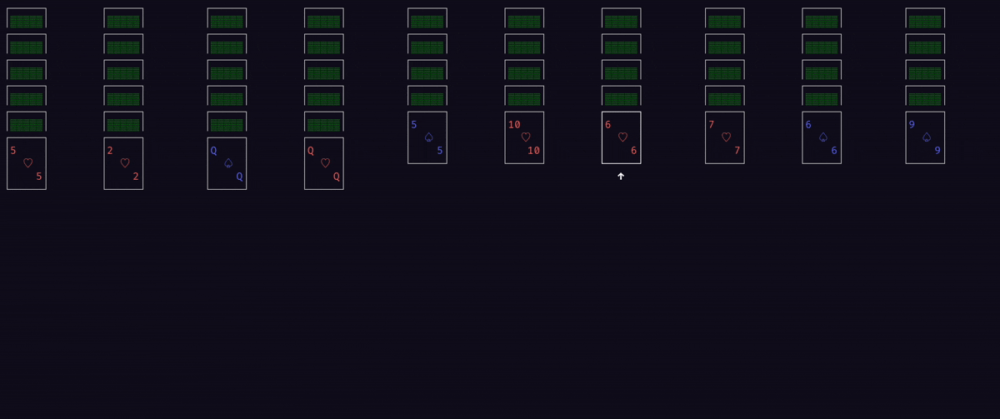

### Spider Solitaire Terminal Game (In development)

## Table of Contents
1. [Status](#status)
2. [TODOs](#todos)
3. [Features/Ideas](#ideas)
4. [Tags](#tags)
5. [License](#license)

## Status
Status: ✅ Mostly playable 🚧 (Still requires some refinement and features)

## TODOs:
1. (✅) Basic logic (each of):
  - [x] Card deck
  - [x] Card sequences
  - [x] Card piles
  - [x] Full sequences
  - [x] Deals
  - [x] Win condition
  - [x] Move cards between piles
2. (✅) ChooseTUI library (one of):
  - (✅) https://github.com/ratatui/ratatui
  - https://github.com/gyscos/cursive
3. (✅) Basic TUI
4. ~~Undo functionality + keybind~~ (✅) Card peek option (Kinda undo replacement, Undo will come later maybe)
5. ~~Hint functionality + keybind~~ (✅) Card peek is hint++ (not rly) by the way
6. Advanced TUI:
  - Splash screen
  - Loading screens
  - Popups and stuff, with relatively good UX
  - UI autosize (shrink cards+else if window is small)
7. Add more features (QoL/auto-features)
8. CLI params
9. (maybe) Other variants of solitaire?
10. (always welcome) Implement some ideas that are nice

## Ideas
- [ ] Card auto size (responsive layout) / Cards zipping (To make sure game ok at least terminal size as possible) + Check area size and calculate what's appropriate
- [ ] help window (+shortcut)
- [ ] full game configuration
- [ ] cli params (use cli lib)
- [ ] (auto-?)save game / resume game
- [x] hjkl
- [x] Auto-select top of last column stack item
- [ ] Sticky-select available pile to move selected card in
- [ ] Ability to auto-move cards to another column (as option)
- [ ] Undos,Redos(maybe), Hint button
- [ ] Timer, (✅)Stockpile usages left, stats, etc
- [ ] (✅)Restart,(✅)New game,100% winnable shuffle option

## Tags

game, binary, terminal-app

## License

Distributed under the GNU GPL License. See `LICENSE` for more information.
